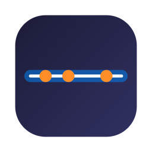

# PixelScheduler

PixelScheduler is a minimalist macOS status bar utility that provides an ambient, persistent visual "Timer Beam" at the edge of your screen. It represents your calendar events throughout the day, helping you stay aware of your schedule without the distraction of traditional calendar apps.

This project is a **Swift rewrite** of the original [PixelScheduler](https://github.com/masayoshimatsuo/pixelscheduler), rebuilt from the ground up for modern macOS using Swift 6 and SwiftUI for better performance and native integration.



## Features

- **Ambient Timer Beam:** A customizable bar on any screen edge representing a 24-hour day.
- **Event Visualization:** Color-coded segments synced directly with your macOS Calendar (EventKit).
- **Interactive Popovers:** Hover over any event segment to see its title, duration, and calendar details.
- **Current Time Indicator:** A subtle marker showing your progress through the day.
- **Multi-Monitor Support:** Choose which display should host the Timer Beam via the status bar menu.
- **Live Preview Settings:** See changes to thickness and colors in real-time as you adjust them.
- **Privacy First:** Only requests access to your calendars; data never leaves your device.

## Usage

1.  **Launch the App:** Once opened, a calendar icon will appear in your macOS menu bar.
2.  **Grant Permissions:** PixelScheduler will request access to your calendars to display events.
3.  **Configure:** Click the menu bar icon and select **Settings...** to customize:
    -   **Position:** Place the beam on the Bottom, Left, or Right edge of your screen.
    -   **Thickness:** Adjust the width/height of the beam.
    -   **Colors:** Customize the base beam and time indicator colors.
    -   **Calendars:** Choose which calendars to display.
4.  **Display Selection:** Use the **Display** submenu in the menu bar to move the beam to a different monitor.

## Advanced Configuration

While the Settings UI offers the safest positioning options, advanced users can manually configure the beam position using the macOS `defaults` command.

### Activating the "Top" Position

The "Top" position is hidden by default in the Settings UI to prevent overlap with the macOS menu bar. If you have a custom setup or want to enable it anyway, run the following command in Terminal:

```bash
# Set position to Top
defaults write com.github.nicholas-1vbw.PixelScheduler beamPosition top

# Restart the app for changes to take effect
```

### Other Position Options

You can also set other positions via Terminal:

```bash
# Valid options: top, bottom, left, right
defaults write com.github.nicholas-1vbw.PixelScheduler beamPosition bottom
defaults write com.github.nicholas-1vbw.PixelScheduler beamPosition left
defaults write com.github.nicholas-1vbw.PixelScheduler beamPosition right
```

### Adjusting Thickness

```bash
# Set thickness to 15 pixels
defaults write com.github.nicholas-1vbw.PixelScheduler beamThickness -float 15.0
```

## Installation

-   Requires macOS 14.0 or later.
-   Built with Swift 6 and SwiftUI.

## Development

To build the project locally:

1.  Clone the repository.
2.  Open `PixelScheduler.xcodeproj` in Xcode 15 or later.
3.  Build and run the `PixelScheduler` scheme.

### Releasing a New Version

PixelScheduler uses GitHub Actions to automatically build and release new versions. To create a new release:

1.  Ensure all changes are committed and pushed to the `main` branch.
2.  Create a new tag locally: `git tag v1.0.0` (replace with the actual version).
3.  Push the tag to GitHub: `git push origin v1.0.0`.
4.  The GitHub Action will trigger, build the app, and create a new GitHub Release with `.dmg` and `.zip` artifacts.

## License

This project is licensed under the MIT License - see the [LICENSE](LICENSE) file for details.
